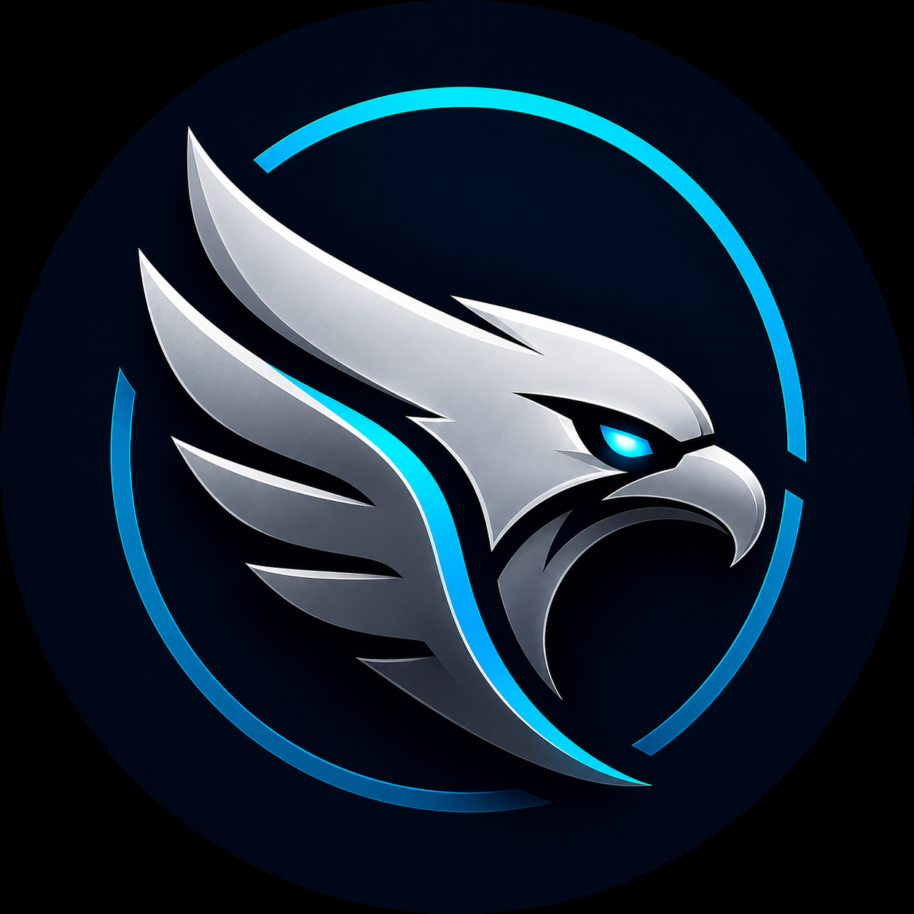
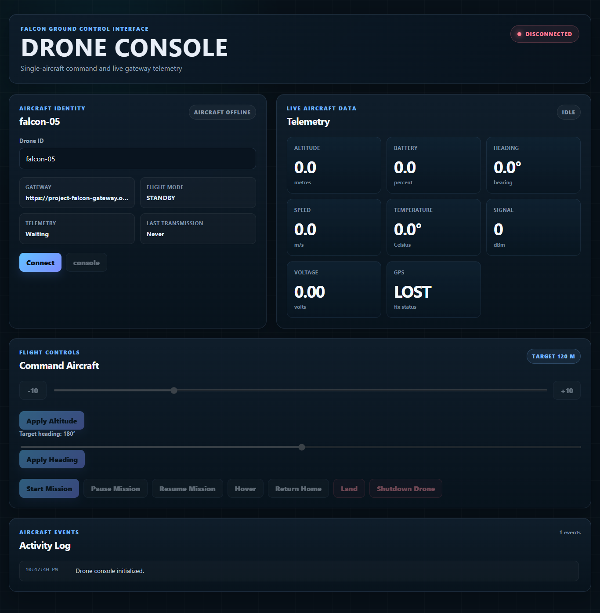

# Project Falcon

<p align="center">
  
</p>

<h1 align="center">Project Falcon</h1>

<p align="center">
<strong>Mission Control for Connected Devices</strong>
</p>

---

## Mission Control Dashboard

<p align="center">
  
</p>

<p align="center">
<em>Mission Control Dashboard providing fleet monitoring, device management, live maps, alerts, and operational intelligence.</em>
</p>

---

The operations dashboard provides:

- Live fleet map
- Aircraft selection
- Flight trail visualization
- Fleet telemetry
- Gateway latency
- Active alerts
- Connection monitoring
- Operational overview

---

<p align="center">
Production-oriented IoT Fleet Management Platform
</p>

<p align="center">


</p>

---

# Drone Console

<p align="center">
  
</p>

<p align="center">
<em>Mission Control dashboard showing live telemetry, fleet status, interactive mapping, and operational health.</em>
</p>

---

Event-Driven • MQTT • gRPC • MongoDB • Socket.IO • React

---

# Highlights

- Real-time IoT fleet monitoring
- MQTT event-driven architecture
- Persistent Device Registry with MongoDB
- gRPC alert microservice
- Live WebSocket telemetry streaming
- Interactive React Mission Control dashboard
- Dockerized multi-service platform
- Azure cloud deployment roadmap

---

# Overview

Project Falcon is a production-oriented IoT fleet management platform built for monitoring, managing, and analyzing fleets of connected devices in real time.

Built around an event-driven architecture, Falcon combines MQTT messaging, WebSocket streaming, gRPC microservices, MongoDB persistence, and a centralized Device Registry to provide persistent fleet state, operational awareness, and live telemetry visualization through a modern Mission Control dashboard.

Although the current implementation simulates autonomous aircraft, the platform is architected to support virtually any connected device including robotics, autonomous vehicles, industrial equipment, environmental sensors, manufacturing systems, embedded devices, and smart infrastructure.

---

# Core Platform Services

| Service | Responsibility |
|----------|----------------|
| Dashboard | Mission Control user interface |
| Gateway | MQTT ingestion and WebSocket routing |
| Device Registry | Persistent fleet inventory and metadata |
| Alert Service | Real-time telemetry analysis |
| Simulator | Aircraft simulation |
| MongoDB | Persistent fleet storage |

---

# Key Features

- Real-time IoT telemetry processing
- Automatic device discovery
- Persistent Device Registry
- MongoDB fleet persistence
- Automatic fleet rehydration after restart
- Interactive device profiles
- Live profile editing
- Device health scoring
- MQTT event-driven messaging
- gRPC microservice architecture
- WebSocket streaming without polling
- Interactive Mission Control dashboard
- Live fleet mapping with Leaflet
- Flight trail visualization
- Dockerized microservice environment
- Repository pattern
- TypeScript throughout the platform
- Azure cloud migration roadmap

---

# System Architecture

```text
                 Drone Simulator
                        │
                  MQTT Telemetry
                        │
                Eclipse Mosquitto
                        │
                        ▼
              Telemetry Gateway
                        │
        ┌───────────────┼────────────────┐
        │               │                │
        ▼               ▼                ▼
  gRPC Alert      Device Registry     MongoDB
    Service             │                │
        │               └────────┬───────┘
        │                        │
        └───────────────┬────────┘
                        ▼
                Socket.IO Gateway
                        │
                        ▼
         React Mission Control Dashboard
```

---

# Technology Stack

## Frontend

- React 19
- TypeScript
- Leaflet
- Socket.IO Client

## Backend

- Node.js
- Express
- MQTT
- gRPC
- Protocol Buffers
- Socket.IO
- MongoDB
- Mongoose

## Infrastructure

- Docker
- Docker Compose
- Eclipse Mosquitto
- npm Workspaces

## Planned Cloud Platform

- Azure IoT Hub
- Azure Container Apps
- Azure Monitor
- Azure Event Hubs
- Azure Device Twins

---

# Documentation

Complete platform documentation is available in the **docs** directory.

Topics include:

- Architecture
- Engineering
- API Reference
- Deployment
- Operations
- Security
- Governance
- Compliance
- User Guide
- Releases
- Roadmap

See:

```text
docs/README.md
```

---

# Platform Capabilities

## Real-Time Telemetry

Each connected aircraft continuously publishes:

- GPS Position
- Heading
- Speed
- Altitude
- Battery Level
- Voltage
- Signal Strength
- Temperature
- Flight Mode

---

## Mission Control Dashboard

The operations dashboard provides:

- Live fleet map
- Aircraft selection
- Flight trail visualization
- Fleet telemetry
- Gateway latency
- Active alerts
- Connection monitoring
- Operational overview

---

## Persistent Fleet Registry

Every connected aircraft is automatically registered and persisted in MongoDB.

Capabilities include:

- Automatic device discovery
- Persistent fleet inventory
- Fleet rehydration after restart
- Device profiles
- Firmware tracking
- Ownership management
- Health scoring
- Online and offline detection
- Live profile editing
- Persistent fleet state

---

## Alert Processing

A dedicated gRPC microservice independently evaluates incoming telemetry and generates operational alerts.

Current alert conditions include:

- Low Battery
- Critical Battery
- Weak Signal
- Critical Signal
- Elevated Temperature
- Critical Temperature

---

# Platform Status

| Component | Status |
|-----------|--------|
| Mission Control Dashboard | ✅ Production Ready |
| Telemetry Gateway | ✅ Production Ready |
| Device Registry | ✅ Production Ready |
| MQTT Messaging | ✅ Operational |
| MongoDB Persistence | ✅ Operational |
| gRPC Alert Service | ✅ Operational |
| Docker Environment | ✅ Operational |
| Azure Migration | 🚧 Planned |

---

# Local Development

Install dependencies

```bash
npm install
```

Build all workspaces

```bash
npm run build
```

Start the platform

```bash
docker compose up --build
```

Mission Control Dashboard

```text
http://localhost:5173
```

Gateway Health Endpoint

```text
http://localhost:5050/api/health
```

---

# Project Roadmap

## Phase 1 ✅ Core Platform

- MQTT Messaging
- Docker Infrastructure
- gRPC Services
- WebSocket Streaming
- React Dashboard
- Drone Simulator

## Phase 2 ✅ Mission Control

- Interactive Fleet Map
- Flight Trail Visualization
- Aircraft Selection
- Fleet Telemetry
- Operational Dashboard

## Phase 3 ✅ Device Management

- Device Registry
- Fleet Management
- Device Profiles
- Firmware Tracking
- Online and Offline Detection
- Live Profile Editing

## Phase 4 ✅ Persistent Fleet Platform

- MongoDB Integration
- Mongoose ODM
- Repository Pattern
- Persistent Device Registry
- Automatic Fleet Rehydration
- Persistent Device Profiles
- Persistent Fleet State

## Phase 5 🚧 Operational Intelligence

- Historical Telemetry
- Mission Replay
- Mission History
- Incident Timeline
- Maintenance History
- Fleet Analytics

## Phase 6

- Azure IoT Hub
- Azure Container Apps
- Azure Monitor
- Azure Event Hubs
- Azure Device Twins
- Production Deployment

## Phase 7

- AI Mission Summaries
- Predictive Maintenance
- Battery Forecasting
- Fleet Intelligence
- Digital Twin Integration

---

# Engineering Practices

Project Falcon demonstrates modern enterprise software engineering practices, including:

- Event-driven architecture
- Publish and subscribe messaging
- Microservice communication
- Repository pattern
- MongoDB persistence
- Real-time WebSocket streaming
- Device Registry pattern
- Operational dashboard design
- Containerized deployment
- Strong TypeScript typing
- Cloud-native architecture
- Operational observability
- Scalable distributed system design

---

# Repository Structure

```text
project-falcon/
│
├── apps/
│   ├── dashboard/
│   ├── gateway/
│   ├── simulator/
│   └── alert-service/
│
├── packages/
│
├── docs/
│   ├── README.md
│   ├── architecture/
│   ├── api/
│   ├── compliance/
│   ├── deployment/
│   ├── engineering/
│   ├── governance/
│   ├── operations/
│   ├── releases/
│   ├── roadmap/
│   ├── security/
│   └── user-guide/
│
├── docker-compose.yml
├── package.json
└── README.md
```

---

# Docs section

docs/
├── README.md
├── screenshot.png
├── screenshot-drone-console.png
├── architecture/
├── api/
├── compliance/
├── deployment/
├── engineering/
├── governance/
├── operations/
├── releases/
├── roadmap/
├── security/
└── user-guide/

---

# Future Vision

Project Falcon is a cloud-native IoT fleet operations platform designed to monitor, manage, and analyze connected devices at scale.

Future releases will extend the platform with historical telemetry, mission replay, fleet analytics, predictive maintenance, AI-assisted operational insights, digital twin capabilities, and Azure-native infrastructure while preserving its event-driven architecture and scalable microservice foundation.

---

# License

MIT