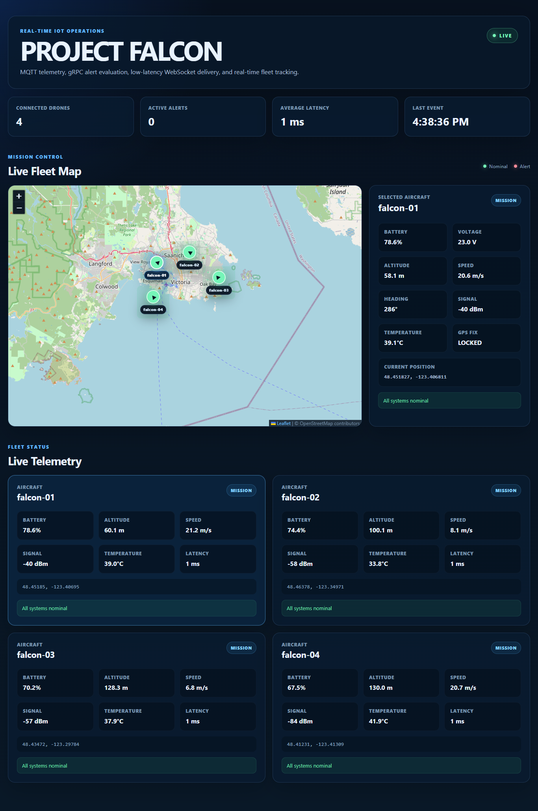

# Project Falcon

<p align="center">
  
</p>

> **Mission Control for Connected Devices**

<p align="center">


</p>

---

# Overview

Project Falcon is a production-oriented IoT operations platform for monitoring, analyzing, and managing fleets of connected devices in real time.

Built around an event-driven architecture, Falcon combines MQTT messaging, gRPC microservices, WebSocket streaming, and a React Mission Control dashboard to deliver low-latency telemetry visualization and operational awareness.

While the current implementation simulates autonomous drones, the underlying architecture is designed to support virtually any connected device, including robotics, autonomous vehicles, industrial equipment, environmental sensors, and embedded systems.

---

# Key Features

- Real-time IoT telemetry processing
- MQTT event-driven messaging
- gRPC microservice architecture
- Live Mission Control dashboard
- Interactive fleet map with Leaflet
- Flight trail visualization
- WebSocket streaming without polling
- Dockerized local deployment
- TypeScript throughout the platform
- Azure IoT migration roadmap

---

# System Architecture

```text
                 Drone Simulator
                        │
                  MQTT Telemetry
                        │
                Eclipse Mosquitto
                        │
                        ▼
              Telemetry Gateway
                        │
        ┌───────────────┴───────────────┐
        │                               │
        ▼                               ▼
  gRPC Alert Service             Device Registry
        │
        ▼
   WebSocket Gateway
        │
        ▼
 React Mission Control Dashboard
```

---

# Technology Stack

## Frontend

- React 19
- TypeScript
- Leaflet
- Socket.IO Client

## Backend

- Node.js
- Express
- MQTT
- gRPC
- Protocol Buffers
- Socket.IO

## Infrastructure

- Docker
- Docker Compose
- Eclipse Mosquitto
- npm Workspaces

## Planned Cloud Platform

- Azure IoT Hub
- Azure Container Apps
- Azure Monitor
- Azure Event Hubs
- Azure Device Twins

---

# Current Capabilities

## Telemetry Processing

Each simulated aircraft continuously publishes:

- GPS Position
- Heading
- Speed
- Altitude
- Battery
- Voltage
- Signal Strength
- Temperature
- Flight Mode

---

## Mission Control Dashboard

The operations dashboard provides:

- Live fleet map
- Aircraft selection
- Flight trail history
- Fleet health
- Active alerts
- Gateway latency
- Connection status

---

## Alert Processing

A dedicated gRPC microservice independently evaluates incoming telemetry and generates operational alerts.

Current alert conditions include:

- Low Battery
- Critical Battery
- Weak Signal
- Critical Signal
- Elevated Temperature
- Critical Temperature

---

# Local Development

Install dependencies

```bash
npm install
```

Start the platform

```bash
docker compose up --build
```

Mission Control Dashboard

```text
http://localhost:5173
```

Gateway Health Endpoint

```text
http://localhost:5050/api/health
```

---

# Project Roadmap

## Phase 1 ✅ Core Platform

- MQTT Messaging
- Docker Infrastructure
- gRPC Services
- WebSocket Streaming
- React Dashboard
- Drone Simulator

## Phase 2 ✅ Mission Control

- Interactive Fleet Map
- Flight Trail Visualization
- Aircraft Selection
- Fleet Telemetry
- Operational Dashboard

## Phase 3 🚧 Device Management

- Device Registry
- Fleet Management
- Aircraft Profiles
- Firmware Tracking
- Online / Offline Detection

## Phase 4

- Historical Telemetry
- Mission Replay
- Incident Timeline
- MongoDB Persistence
- Fleet Analytics

## Phase 5

- Azure IoT Hub
- Azure Container Apps
- Azure Monitor
- Event Hubs
- Production Deployment

## Phase 6

- AI Mission Summaries
- Predictive Maintenance
- Battery Forecasting
- Fleet Intelligence
- Digital Twin Integration

---

# Engineering Principles

Project Falcon is being developed using modern enterprise engineering practices, including:

- Event-driven architecture
- Low-latency telemetry
- Microservice design
- Containerized deployment
- Real-time visualization
- Cloud-native architecture
- Operational observability
- Scalable system design

---

# Repository Structure

```text
project-falcon/
│
├── apps/
│   ├── dashboard/
│   ├── gateway/
│   ├── simulator/
│   └── alert-service/
│
├── packages/
│
├── docs/
│   ├── screenshot.png
│   ├── architecture.png
│   └── roadmap.md
│
├── docker-compose.yml
├── package.json
└── README.md
```

---

# License

MIT